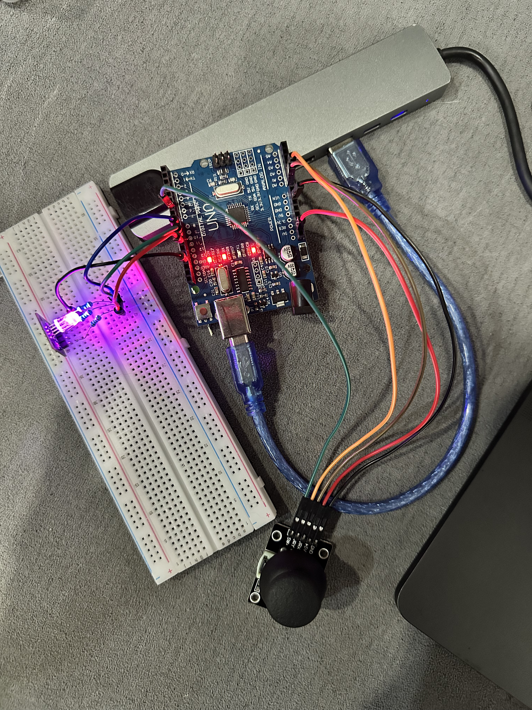
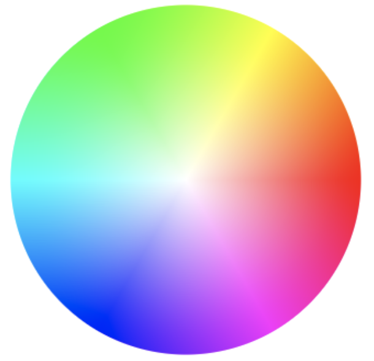

## PHYSICAL COLOR WHEEL

We built a physical color wheel using Arduino.

<table>
  <tr>
    <td align="center">
      
    </td>
    <td align="center">
      
    </td>
  </tr>
</table>

---

## How it Works

This project uses an Arduino, an RGB LED, and a joystick to create a physical color wheel. The joystick controls the color output of the RGB LED in real time.

### Hardware
- **RGB LED**: Connected to pins 9 (Blue), 10 (Green), and 11 (Red) via current-limiting resistors.
- **Joystick**: X-axis to A0, Y-axis to A1. Powered by 5V and GND.

### Code Overview
- **Pin Setup**: The RGB pins are set as outputs. The joystick axes are read as analog inputs.
- **Main Loop**: Reads the joystick's X and Y positions, then maps these to a color on the HSV color wheel.
- **Color Mapping**: The joystick's direction (angle from center) determines the hue (0–360°). Full saturation and brightness are used, so pushing the stick in any direction gives a vivid color.
- **HSV to RGB**: The code converts the calculated hue to RGB values using the `hsvToRgb` function, then sets the LED color.
- **Serial Output**: The current X and Y readings are printed to the serial monitor for debugging.

### Usage
1. Wire up the joystick and RGB LED as described above.
2. Upload the code to your Arduino.
3. Move the joystick—the LED color will change according to the direction you push.

---

